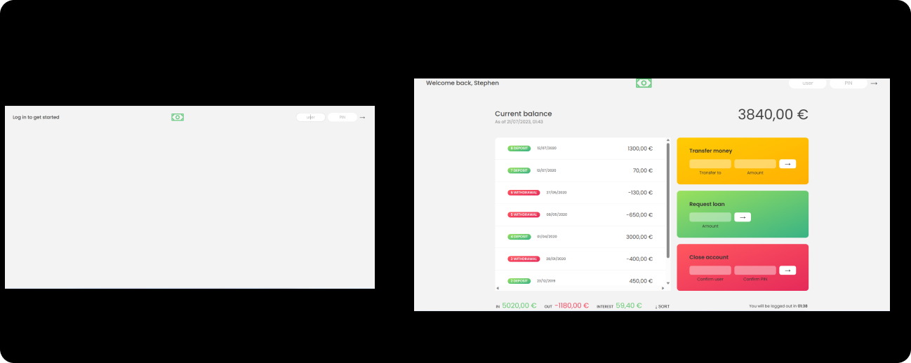

# Bank App Project
> This is a JavaScript-based Bank App project that provides various banking functionalities such as user login, multiple user management, money transfer, loan requests, account deletion, and transaction sorting. The app is designed to provide a simple and intuitive interface for users to interact with their bank accounts.

## Features
1- User Login: The app allows users to log in securely using their credentials.

2- Multiple Users: The app supports multiple user accounts

3- Money Transfer: Users can transfer money between their own accounts or to other users within the system.

4- Loan Requests: Users can request a loan by specifying the desired amount and other relevant details.

5- Account Deletion: Users have the option to delete their account if they no longer wish to use the app. Account deletion ensures the removal of all associated data and provides a secure process for users.

6- Transaction Sorting: The app allows users to sort their transaction history based on various criteria such as date, amount, or transaction type. This feature helps users quickly find and analyze their past transactions.

## Technologies Used
 The Bank App project is built using the following technologies:

- **JavaScript: The core programming language used to implement the app's functionalities and logic.**

## Contributing
 Contributions to the Bank App project are welcome and encouraged! If you would like to contribute, please follow these steps:

- **Fork the repository on GitHub.**

- **Create a new branch with a descriptive name for your feature or bug fix.**

- **Make the necessary code changes and commit them.**

- **Push your changes to your forked repository.**

- **Submit a pull request to the main repository, explaining the changes you have made.**

- **Please ensure that your code follows the project's coding standards and conventions.**
